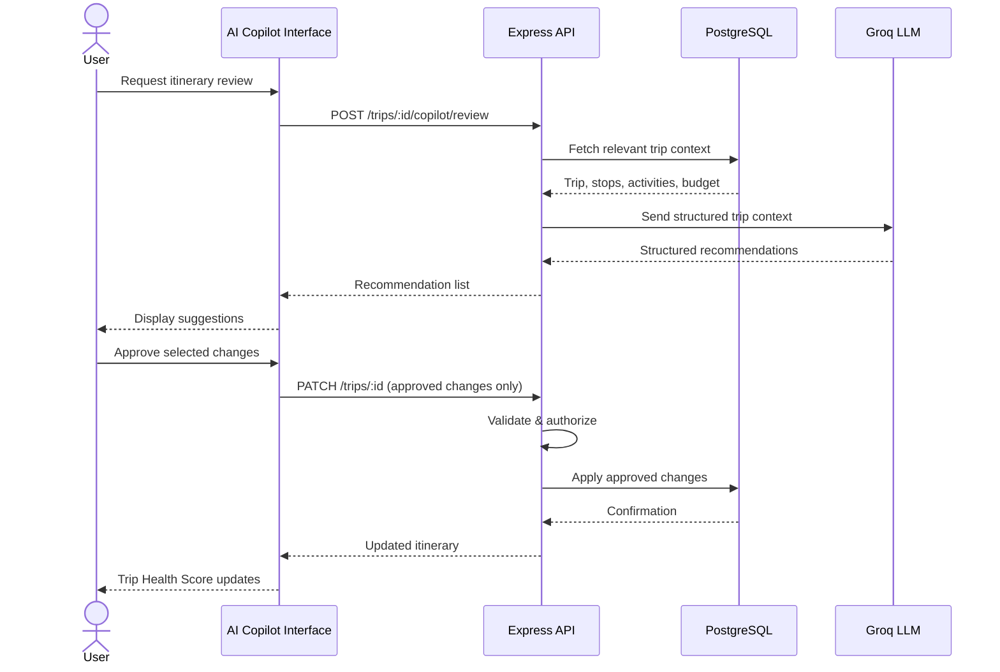
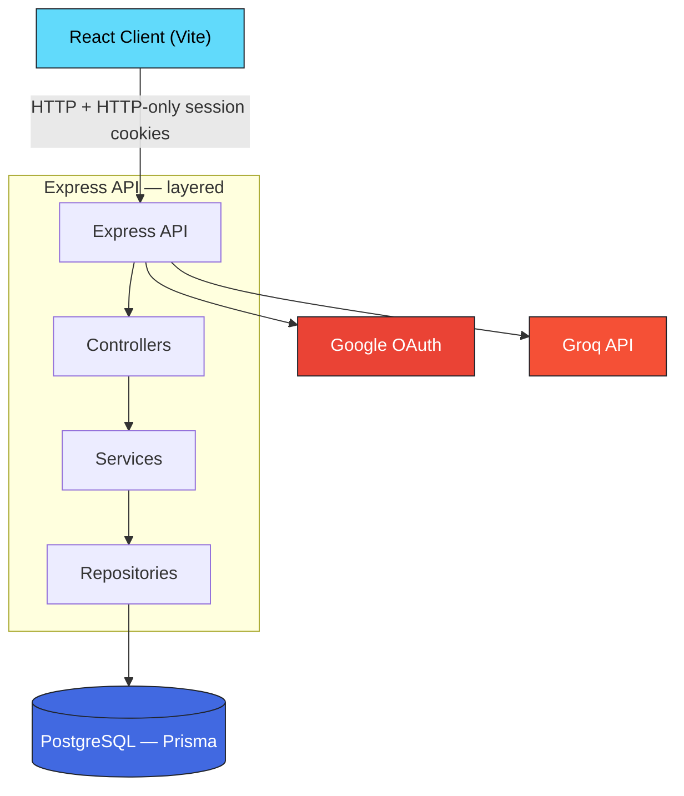
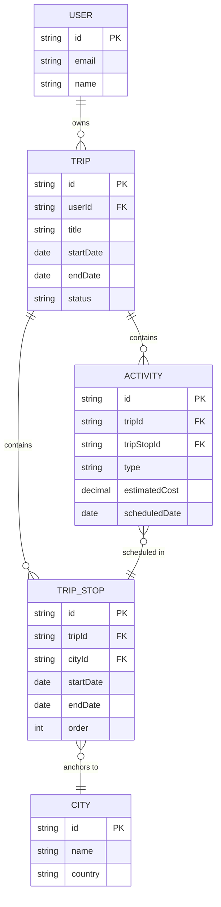

<div align="center">
  

  # GlobeTrotter

  **Plan multi-city trips end to end — itinerary, budget, timeline, and an AI copilot that reviews your plan before you leave home.**

  [](#tech-stack)
  [](#tech-stack)
  [](#tech-stack)
  [](#tech-stack)
  [](#tech-stack)
  [](#tech-stack)
  [](#ai-travel-copilot)
  [](#)
  [](./LICENSE)

</div>

<br/>

GlobeTrotter is a full-stack travel planning platform for creating and managing multi-city trips. Users build day-wise itineraries, organize activities, track estimated expenses against a live budget, visualize the trip as a timeline, and publish read-only versions of their trips for anyone to view — or remix as a starting point for their own.

It's built around one idea: **an itinerary is structured data, not a document.** Trips, stops, activities, and budgets are first-class relational entities. That single decision is what makes timelines, cost breakdowns, sharing, and AI recommendations possible without hacks.

---

## Table of Contents

- [Demo](#demo)
- [The Problem](#the-problem)
- [The Solution](#the-solution)
- [Features](#features)
- [AI Travel Copilot](#ai-travel-copilot)
- [Tech Stack](#tech-stack)
- [Architecture](#architecture)
- [Data Model](#data-model)
- [API Surface](#api-surface)
- [Security](#security)
- [Project Structure](#project-structure)
- [Getting Started](#getting-started)
- [Roadmap](#roadmap)
- [Demo Walkthrough](#demo-walkthrough)
- [Engineering Decisions Worth Noting](#engineering-decisions-worth-noting)
- [Team](#team)
- [License](#license)

---

## Demo

| Resource | Link |
|---|---|
| **Live Application** | `<!-- add deployment URL here -->` |

<div align="center">

| Dashboard | Itinerary Builder | Budget & Timeline |
|:---:|:---:|:---:|
|  |  |  |

*Drop screenshots into `docs/screenshots/` using the filenames above and they'll render automatically.*

</div>

---

## The Problem

Planning a multi-city trip today means juggling:

- Dates, cities, and day plans in a spreadsheet
- Costs in a notes app that nobody keeps updated
- Activities scattered across browser tabs and screenshots
- A group chat full of "so what's the plan for day 3?"

Existing tools either force you into a rigid template or hand you a blank doc with none of the math done. Nobody answers the questions that actually matter before a trip: *Is day 4 overloaded? Are we over budget? Is there a better order for this?*

## The Solution

GlobeTrotter puts the entire journey in one place:

- **Structure** — trips, city stops, dated activities, and costs stored relationally, not as free text
- **Insight** — live budget totals, category-wise spending, average daily cost, and a timeline that exposes empty or overloaded days
- **Intelligence** — an AI copilot that audits the finished itinerary and proposes concrete fixes, which you approve before anything changes
- **Sharing** — a public read-only link per trip, plus one-click "remix" to fork someone's plan as your own

---

## Features

### Plan
- **Google OAuth authentication** — secure sessions via HTTP-only cookies, invisible to client-side JavaScript
- **Trip management** — name, dates, description, cover image; active and completed trips separated automatically
- **Multi-city itinerary builder** — unlimited stops per trip, each with its own date range, reorderable at any time
- **Activity discovery** — search and filter activities by type, estimated cost, duration, and destination, then drop them onto any city and day

### Understand
- **Budget tracking** — estimated totals across transport, accommodation, activities, and meals; category-wise breakdown, average daily cost, budget usage, and over-budget warnings — all computed in backend business logic, never ad hoc in UI components
- **Timeline view** — the whole trip at a glance: duration, city sequence, daily activity load, and days that are empty or overloaded
- **Day-wise itinerary view** — list and calendar-style views over the same structured data, with timing, ordering, and per-activity cost
- **Trip Health Score** — an explainable 0–100 rating derived from budget usage, activities per day, overloaded days, and overall balance:

  > **Trip Health: 86/100 — Well Balanced**

  Not a black box — every point deduction traces back to a concrete property of the itinerary.

### Share
- **Public trip links** — read-only pages anyone can open without an account or edit permissions
- **Remix** — viewers can copy a shared trip into their account as the starting point for their own plan

### Personalize
- **Travel preferences** — food, adventure, culture, nature, budget or luxury travel — feeding directly into recommendations and the AI copilot

---

## AI Travel Copilot

> AI is an additional layer, not a dependency. If the AI service is unavailable, the entire product remains fully functional.

The copilot analyzes a completed itinerary and suggests improvements:

- Reduce unnecessary costs
- Balance overloaded days and fill empty ones
- Reorder activities for better flow
- Suggest additional activities matched to user preferences



Three deliberate design choices:

1. **The AI never touches the database.** It receives only the trip context needed to generate recommendations.
2. **Nothing applies automatically.** Every suggestion passes through human review.
3. **Approved changes still go through the application's normal validation and authorization flow.** The AI path introduces zero new ways to mutate data.

This makes the copilot safe to expose, easy to disable, and impossible to abuse as a data channel.

---

## Tech Stack

| Layer | Technology |
|---|---|
| **Frontend** | React 19, Vite, TypeScript, Tailwind CSS 4, React Router, TanStack Query, React Hook Form, Zod |
| **Backend** | Node.js, Express 5, TypeScript, Zod validation, Helmet, CORS, HTTP-only cookie sessions |
| **Database** | PostgreSQL, Prisma ORM (schema management, migrations, typed access, seeding) |
| **Auth** | Google OAuth |
| **AI** | Groq API (inference for the Travel Copilot) |

---

## Architecture

Clean separation of responsibilities across three layers:



- **Frontend** — rendering, routing, forms, interaction, client state, API communication. No database logic, no critical business rules.
- **Backend** — authentication, authorization, request validation, business logic, database operations, external integrations. Controllers stay thin; logic lives in services; data access is isolated in repositories.
- **Database** — relationships, foreign keys, constraints, migrations, seed data. Normalized relational tables, enforced ownership through foreign keys — no critical entities dumped into JSON blobs.
- **Shared code** — Zod schemas, domain types, and constants used verbatim by both client and server, so a change to a contract fails fast on both sides.

---

## Data Model

Trips own ordered stops; stops anchor to cities; activities belong to trips and slot into stop dates. Ownership is enforced at the schema level, which is what makes authorization checks simple and reliable.



---

## API Surface

A representative view of the resource groups exposed by the API — see `Backend/server/src/routes` for exact route definitions.

| Domain | Example endpoints | Description |
|---|---|---|
| Auth | `GET /auth/google`, `GET /auth/google/callback` | Google OAuth login flow, session issued as an HTTP-only cookie |
| Trips | `GET/POST/PATCH/DELETE /api/trips` | CRUD for trips, ownership-scoped |
| Stops | `POST/PATCH/DELETE /api/trips/:id/stops` | Manage ordered city stops within a trip |
| Activities | `GET /api/activities`, `POST /api/trips/:id/activities` | Discover and attach activities to a stop/day |
| Budget | `GET /api/trips/:id/budget` | Computed category-wise budget breakdown |
| Copilot | `POST /api/trips/:id/copilot/review` | AI-generated, human-approved recommendations |
| Sharing | `GET /api/trips/:id/public`, `POST /api/trips/:id/remix` | Public read-only view and one-click remix |

---

## Security

- Google OAuth with HTTP-only cookies (secure cookies in production)
- Zod validation at every API boundary
- Authorization checks on all user-owned resources
- Helmet security headers and strict CORS configuration
- Secrets only in environment variables — the frontend never sees tokens or credentials it does not need

---

## Project Structure

```text
odoohackathon/
│
├── ODOO_Frontend/                 # React + Vite client
│   └── src/
│       ├── api/                   # API client and request functions
│       ├── components/            # Reusable UI components
│       ├── constants/
│       ├── features/              # Feature-specific UI and logic
│       ├── forms/
│       ├── hooks/
│       ├── layouts/
│       ├── pages/                 # Route-level pages
│       ├── routes/
│       ├── types/
│       └── utils/
│
├── Backend/                       # Express API
│   ├── server/src/
│   │   ├── config/                # Environment and app configuration
│   │   ├── controllers/           # HTTP request handlers
│   │   ├── middleware/            # Auth, error, security
│   │   ├── repositories/          # Database access
│   │   ├── routes/                # API route definitions
│   │   ├── services/              # Business logic (itinerary, budget, trip)
│   │   └── app.ts
│   ├── prisma/
│   │   ├── schema.prisma
│   │   ├── migrations/
│   │   └── seed.ts                # Demo data for local dev
│   └── shared/types/
│
└── README.md
```

---

## Getting Started

### Prerequisites

- Node.js 18+
- npm
- PostgreSQL running locally (or a hosted connection string)
- Git
- Optional: Google OAuth credentials and a Groq API key (only required for the AI Copilot)

### 1. Clone and install

```bash
git clone <repo-url>
cd odoohackathon

# Backend
cd Backend
npm install

# Frontend
cd ../ODOO_Frontend
npm install
```

### 2. Configure environment

Create `.env` files from `.env.example` in each package:

```env
DATABASE_URL=

GOOGLE_CLIENT_ID=
GOOGLE_CLIENT_SECRET=
GOOGLE_CALLBACK_URL=

COOKIE_SECRET=

GROQ_API_KEY=

CLIENT_URL=
SERVER_URL=
```

> **Never commit real credentials or API keys.**

### 3. Set up the database

```bash
cd Backend
npx prisma migrate dev     # apply schema
npx prisma db seed         # load demo data
```

### 4. Run

```bash
# Terminal 1 — API (from Backend/)
npx tsx watch server/src/app.ts

# Terminal 2 — Client (from ODOO_Frontend/)
npm run dev
```

Open the Vite URL shown in terminal 2, sign in with Google, and start planning.

---

## Roadmap

Deliberately out of scope for the MVP — designed for, not bolted on:

- **Long-term travel memory** — persisting preferences and past-trip context across sessions so recommendations improve over time
- **Redis layer** — API rate limiting, AI request throttling, caching popular destinations
- **RAG over a curated destination knowledge base** — grounded activity and logistics recommendations once retrieval has high-quality data to draw from
- **Audit logs** — trip created/updated/deleted, activity added/removed, trip shared
- **Collaborative planning** — multi-user trips with roles
- **Analytics dashboard** — spending trends and planning patterns

Scope discipline was a feature here: every item above earns its place only when the core journey demands it.

---

## Demo Walkthrough

A complete story in ~90 seconds:

1. Sign in with Google
2. Land on the dashboard — upcoming and recent trips
3. Create a trip, add two cities with date ranges
4. Discover and add activities to each day
5. Open the budget view — totals update live, including an over-budget warning
6. Switch to the timeline — spot an overloaded day and an empty one
7. Ask the AI Copilot — review its suggestions, approve two, reject one
8. Watch the Trip Health Score climb
9. Publish the public link and open it in a private window — read-only, then remix it

*If optional features misbehave on stage, steps 1–6 alone demonstrate the complete core journey.*

---

## Engineering Decisions Worth Noting

- **Structured data over documents** — every feature above exists because the itinerary is queryable relational data, not rich text
- **Layered backend** — `routes → controllers → services → repositories`; business logic is testable and UI-independent
- **Contracts shared, not duplicated** — one set of Zod schemas validates on both sides of the network boundary
- **Graceful degradation** — the AI copilot is additive; removing it removes nothing else
- **Honest scope** — infrastructure like Redis, RAG, and memory systems were consciously deferred instead of half-integrated

Keep the travel-planning core reliable. Keep optional intelligence isolated. Ship the complete user journey first.

---

## Team

| Name | GitHub |
|---|---|
| Pranshu Pujara | [@PranshuPujara](https://github.com/PranshuPujara) |
| Aum | [@aumsantoki99-web](https://github.com/aumsantoki99-web) |
| Chand Vadaliya | [@chandvadaliya](https://github.com/chandvadaliya) |
| Palash Kulkarni | [@PalashKulkarni](https://github.com/PalashKulkarni) |

---

## License

Released under the [MIT License](./LICENSE).

<div align="center">

**GlobeTrotter** — because the best trip starts with a plan you can actually see.

</div>
